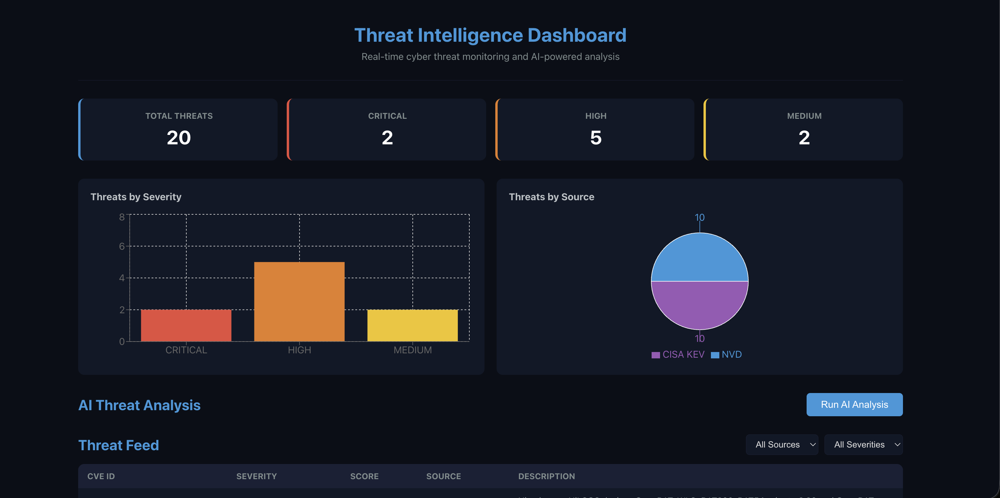
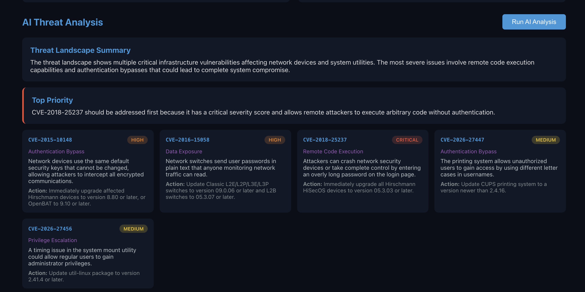

# 🛡️ Threat Intelligence Dashboard

An AI-powered threat intelligence platform that aggregates OSINT feeds, uses Claude AI to analyze and prioritize vulnerabilities, and presents actionable insights through a real-time dashboard.





---

## Overview

Security teams are overwhelmed by the volume of vulnerability disclosures. This dashboard solves that by automatically collecting threat data from multiple OSINT sources, using AI to cluster, categorize, and summarize threats, and surfacing what matters most in a clean, interactive UI.

### What It Does

- **Aggregates** vulnerability data from NVD and CISA KEV feeds in real time
- **Stores** and deduplicates threats in a local SQLite database
- **Analyzes** threats using Claude AI — generating plain-English summaries, risk assessments, MITRE ATT&CK categorization, and prioritized action items
- **Visualizes** the threat landscape with severity breakdowns, source distribution charts, and a filterable threat feed

---

## Architecture

```
┌─────────────────────────────────────────────────────┐
│                   React Frontend                     │
│  ┌──────────┐  ┌──────────┐  ┌───────────────────┐  │
│  │ Severity  │  │  Source   │  │   Threat Table    │  │
│  │  Charts   │  │  Charts  │  │  with Filters     │  │
│  └──────────┘  └──────────┘  └───────────────────┘  │
│  ┌───────────────────────────────────────────────┐   │
│  │          AI Analysis Panel                     │   │
│  │  Summary │ Priority │ Per-CVE Breakdown       │   │
│  └───────────────────────────────────────────────┘   │
└──────────────────────┬──────────────────────────────┘
                       │ HTTP (fetch)
                       ▼
┌─────────────────────────────────────────────────────┐
│                 FastAPI Backend                       │
│                                                      │
│  GET /threats       - List & filter vulnerabilities  │
│  GET /threats/stats - Severity & source counts       │
│  GET /analyze       - AI-powered threat briefing     │
└─────┬───────────────────────────────────┬───────────┘
      │                                   │
      ▼                                   ▼
┌──────────────┐                 ┌─────────────────┐
│   SQLite DB   │                │   Claude AI API  │
│  (threats.db) │                │  (Anthropic)     │
└──────┬───────┘                 └─────────────────┘
       │
       ▼
┌─────────────────────────────────────────────────────┐
│              Data Ingestion Pipeline                  │
│                                                      │
│  ┌─────────────────┐    ┌──────────────────────┐    │
│  │   NVD Fetcher    │    │   CISA KEV Fetcher    │    │
│  │  (CVE database)  │    │ (Exploited vulns)     │    │
│  └─────────────────┘    └──────────────────────┘    │
└─────────────────────────────────────────────────────┘
```

---

## Features

### Data Ingestion
- **NVD (National Vulnerability Database):** Pulls recent CVEs with CVSS severity scores from NIST's public API
- **CISA KEV (Known Exploited Vulnerabilities):** Fetches actively exploited vulnerabilities that require urgent attention
- Automatic deduplication prevents storing the same CVE twice

### AI Analysis (Claude)
- **Threat Landscape Summary:** High-level overview of the current threat environment
- **Categorization:** Maps each CVE to attack types (Remote Code Execution, Privilege Escalation, Data Exposure, etc.)
- **Risk Assessment:** AI-determined priority beyond just CVSS scores
- **Plain-English Summaries:** Non-technical explanations anyone can understand
- **Actionable Recommendations:** Specific remediation steps for each threat

### Dashboard
- **Severity Cards:** At-a-glance count of Critical, High, Medium, and Low threats
- **Bar Chart:** Visual breakdown of threats by severity level
- **Pie Chart:** Distribution of threats across data sources
- **Filterable Threat Table:** Sort and filter by source or severity
- **AI Analysis Panel:** One-click AI briefing with prioritized findings

---

## Tech Stack

| Layer          | Technology                                      |
|----------------|------------------------------------------------|
| Frontend       | React 19, Recharts                             |
| Backend API    | Python, FastAPI, Uvicorn                       |
| Database       | SQLite via SQLAlchemy                          |
| AI Engine      | Claude API (Anthropic)                         |
| Data Sources   | NVD REST API, CISA KEV JSON Feed              |

---

## Getting Started

### Prerequisites

- Python 3.10+
- Node.js 18+
- An [Anthropic API key](https://console.anthropic.com)

### Installation

1. **Clone the repository**
   ```bash
   git clone https://github.com/jasimalnajjar/threat-intel-dashboard.git
   cd threat-intel-dashboard
   ```

2. **Set up the backend**
   ```bash
   python3 -m venv venv
   source venv/bin/activate
   pip install requests sqlalchemy anthropic python-dotenv fastapi uvicorn
   ```

3. **Configure your API key**

   Create a `.env` file in the project root:
   ```
   ANTHROPIC_API_KEY=your-api-key-here
   ```

4. **Run the data ingestion**
   ```bash
   python -m backend.app.services.ingestion.run_ingestion
   ```

5. **Start the API server**
   ```bash
   python -m uvicorn backend.app.main:app --reload
   ```

6. **Start the frontend** (in a new terminal)
   ```bash
   cd frontend
   npm install
   npm start
   ```

7. **Open the dashboard** at [http://localhost:3000](http://localhost:3000)

---

## API Endpoints

| Method | Endpoint          | Description                          |
|--------|-------------------|--------------------------------------|
| GET    | `/`               | Health check                         |
| GET    | `/threats`        | List threats (filterable by source, severity) |
| GET    | `/threats/stats`  | Aggregated severity and source counts |
| GET    | `/analyze`        | Run AI analysis on stored threats    |

### Example Request

```bash
# Get all critical threats from NVD
curl "http://127.0.0.1:8000/threats?source=NVD&severity=CRITICAL&limit=10"
```

---

## Project Structure

```
threat-intel-dashboard/
├── backend/
│   └── app/
│       ├── __init__.py
│       ├── main.py                     # FastAPI application
│       ├── models.py                   # SQLAlchemy database models
│       └── services/
│           ├── __init__.py
│           ├── ai/
│           │   ├── __init__.py
│           │   └── analyzer.py         # Claude AI threat analysis
│           └── ingestion/
│               ├── __init__.py
│               ├── nvd_fetcher.py      # NVD CVE data fetcher
│               ├── cisa_fetcher.py     # CISA KEV data fetcher
│               └── run_ingestion.py    # Orchestrates all fetchers
├── frontend/
│   └── src/
│       ├── App.js                      # Main dashboard component
│       └── App.css                     # Dashboard styling
├── .env                                # API key (not committed)
├── .gitignore
└── README.md
```

---

## Data Sources

| Source | Description | Update Frequency | URL |
|--------|-------------|-----------------|-----|
| NVD | Complete U.S. vulnerability database maintained by NIST | Continuously | [nvd.nist.gov](https://nvd.nist.gov) |
| CISA KEV | Confirmed actively exploited vulnerabilities | As discovered | [cisa.gov/known-exploited-vulnerabilities](https://www.cisa.gov/known-exploited-vulnerabilities-catalog) |

---

## Future Improvements

- [ ] Add AlienVault OTX and Abuse.ch (URLhaus, ThreatFox) feeds
- [ ] Semantic search using embeddings and a vector database
- [ ] MITRE ATT&CK framework mapping visualization
- [ ] Scheduled auto-ingestion with APScheduler
- [ ] Dockerized deployment with Docker Compose
- [ ] Threat trend analysis over time
- [ ] Email/Slack alerting for critical threats
- [ ] User authentication and role-based access

---

## License

This project is licensed under the MIT License — see the [LICENSE](LICENSE) file for details.

---

## Acknowledgments

- [NIST National Vulnerability Database](https://nvd.nist.gov) for CVE data
- [CISA](https://www.cisa.gov) for the Known Exploited Vulnerabilities catalog
- [Anthropic](https://www.anthropic.com) for the Claude AI API